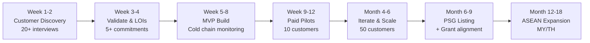

> **Historical reference — do not use as current implementation guidance.** See the [current business plan](../../business_plan_2026-07-18.md).

# IIoT SaaS Platform — Business Viability Analysis

> **Historical analysis:** This document records the April 2026 thesis and contains product, pricing, roadmap, and grant assumptions that are now stale. Use the [Updated Novena Business Plan — 18 July 2026](business_plan_2026-07-18.md) for current decisions.

> **Date:** April 2026  
> **Premise:** An AI-powered IIoT SaaS platform for SMEs in Singapore & ASEAN that makes industrial device monitoring plug-and-play — no deep technical expertise required.

---

## 1. Executive Summary

**Verdict: Conditional GO ✅** — The market is real, growing fast, and underserved at the SME layer. But execution strategy matters enormously. The difference between a profitable business and an expensive hobby comes down to *how* we go to market, not *whether* the market exists.

The opportunity is a **"Shopify for Industrial IoT"** — a dead-simple platform that lets non-technical factory owners, building managers, and facility operators connect their equipment, see dashboards, get alerts, and act on AI insights, without hiring an integrator or writing code.

---

## 2. Market Analysis

### 2.1 Market Size

| Metric | Value | Source |
|--------|-------|--------|
| **Southeast Asia IIoT Market (2032)** | ~$6.87 billion | Meticulous Research |
| **ASEAN IIoT CAGR (2025–2032)** | 19.1% | Meticulous Research |
| **Singapore IoT Market CAGR (through 2031)** | ~13.5% | 6W Research |
| **Singapore Industrial IoT (2029 projected)** | US$1.48 billion | SPTel/Industry reports |
| **Total Singapore SMEs** | ~369,500 enterprises | SingStat 2025 |

### 2.2 TAM → SAM → SOM Estimation

```
TAM (Total Addressable Market)
  All SMEs in ASEAN with industrial equipment
  → Estimated 2-3 million businesses across SG, MY, TH, VN, ID, PH
  → ~$3-5B annual spend potential on monitoring/automation SaaS

SAM (Serviceable Available Market)
  SMEs in Singapore + Malaysia + Thailand with PLCs, sensors, SCADA
  that are actively seeking digital transformation solutions
  → ~50,000-100,000 businesses
  → ~$500M-$1B annual spend potential

SOM (Serviceable Obtainable Market) — Year 1-3
  Singapore-based SMEs in manufacturing, cold chain, energy, buildings
  that we can realistically reach through direct sales + partners
  → ~2,000-5,000 targetable businesses
  → At $200-500/mo ARPU = $4.8M - $30M ARR potential in Year 3
```

> [!IMPORTANT]
> **The market exists and it's growing at ~19% CAGR.** This is not a "nice to have" — regulatory pressure (ESG reporting, energy efficiency mandates), labor shortages, and rising costs are *forcing* SMEs to digitize. The question is whether they'll buy from us or someone else.

### 2.3 Why NOW?

1. **Post-COVID operational resilience** — Remote monitoring is no longer optional
2. **Singapore Green Plan 2030** — Energy reporting mandates pushing adoption
3. **AI maturity** — GPT-era AI makes "smart alerts" actually smart for the first time
4. **Cloud cost deflation** — Running IoT infrastructure is 60-70% cheaper than 5 years ago
5. **Government grants** — Singapore is subsidizing 50-70% of digital transformation costs (EEG, EDG, PSG)

---

## 3. Customer Pain Points (Why SMEs AREN'T Already Using IoT)

Based on research, here are the real blockers — and they're the basis for our entire value proposition:

### ❌ Pain Point 1: "It's too complicated to set up"
- Existing platforms (ThingsBoard, Ignition, AVEVA) require OT engineers or system integrators
- An SME factory owner doesn't know what MQTT, Modbus, or OPC-UA means
- Integration projects typically cost $20K-$100K+ with a system integrator

### ❌ Pain Point 2: "I don't know what I'm looking at"
- Raw sensor data is meaningless without context
- Existing dashboards are designed for engineers, not business owners
- No one is translating data into "your compressor is about to fail" or "you're wasting $800/month on energy"

### ❌ Pain Point 3: "I can't justify the cost"
- Enterprise IoT platforms cost $1K-$10K+/month
- Hardware + integration + platform + ongoing support = massive CAPEX
- SME budgets are $100-$500/month for "technology experiments"

### ❌ Pain Point 4: "I don't have IT staff"
- Most SMEs have zero in-house IT, let alone OT expertise
- They need it to "just work" — like plugging in a WiFi router

### ❌ Pain Point 5: "I'm scared of vendor lock-in"
- Burned by proprietary systems before
- Want flexibility to add/remove devices without being trapped

> [!TIP]
> **These pain points are our MOAT if we solve them.** Enterprise players won't simplify their products enough (it cannibalizes their services revenue). Low-code platforms like Ubidots get close but still require technical setup. There's a real gap for a true "plug and play" experience.

---

## 4. Competitive Landscape

### 4.1 Competitor Map

| Category | Players | Pricing | Strengths | Weaknesses for SMEs |
|----------|---------|---------|-----------|---------------------|
| **Enterprise Platforms** | AVEVA, Schneider EcoStruxure, Siemens MindSphere | $5K-$50K+/mo | Comprehensive, industrial-grade | Way too complex and expensive |
| **Mid-Market IoT** | ThingsBoard (PE), Losant, AWS IoT | $250-$1K+/mo | Flexible, scalable | Requires developers/integrators |
| **SME-Friendly** | Ubidots, Blynk, Particle.io | $29-$199/mo | Easy dashboards, low-code | Limited industrial protocol support, no AI insights |
| **Local SG Players** | Auk Industries, Green Koncepts, Controtek, SPTel IoT-aaS | Varies | Local presence, gov't connections | Niche-focused, not plug-and-play |
| **DIY/Open Source** | ThingsBoard CE, Node-RED, Grafana | Free (+ infra) | Cheap, flexible | Requires serious technical skill |

### 4.2 Competitive Gap Analysis

```mermaid
quadrant-chart
    title IoT Platform Positioning
    x-axis "Complex Setup" --> "Plug & Play"
    y-axis "Basic Monitoring" --> "AI-Powered Insights"
    quadrant-1 "OUR TARGET ZONE"
    quadrant-2 "Enterprise Leaders"
    quadrant-3 "DIY / Open Source"
    quadrant-4 "Current SME Tools"
    "AVEVA/Schneider": [0.15, 0.85]
    "ThingsBoard PE": [0.25, 0.65]
    "Losant": [0.30, 0.70]
    "AWS IoT": [0.20, 0.60]
    "Ubidots": [0.60, 0.45]
    "Blynk": [0.70, 0.30]
    "Particle.io": [0.65, 0.35]
    "ThingsBoard CE": [0.15, 0.40]
    "OUR PLATFORM": [0.85, 0.80]
```

> [!IMPORTANT]
> **The quadrant of "Plug & Play + AI Insights" is essentially empty.** Nobody is combining dead-simple onboarding with genuinely intelligent analytics for the SME tier. This is our beachhead.

---

## 5. Business Model & Unit Economics

### 5.1 Proposed Pricing Model

| Tier | Price/mo | Devices | Features | Target |
|------|----------|---------|----------|--------|
| **Starter** | S$99/mo (~US$75) | Up to 10 devices | Monitoring, alerts, basic dashboard | Micro-businesses, 1-2 machines |
| **Professional** | S$299/mo (~US$225) | Up to 50 devices | + AI anomaly detection, energy reports, multi-site | Small factories, cold chain |
| **Business** | S$699/mo (~US$525) | Up to 200 devices | + Predictive maintenance, compliance reports, API access | Mid-size facilities |
| **Enterprise** | Custom | Unlimited | + White-label, dedicated support, custom integrations | Large SMEs, franchise chains |

### 5.2 Revenue Streams

1. **Platform subscription** (core — 60-70% of revenue)
2. **Hardware margin** — Pre-configured IoT gateways sold at ~30-40% margin (15-20% of revenue)
3. **Professional services** — Onboarding, custom dashboards, integration support (10-15% of revenue)
4. **AI add-ons** — Predictive maintenance, energy optimization reports (future upsell — 5-10% of revenue)

### 5.3 Unit Economics Model (Year 2 Target)

| Metric | Target | Benchmark |
|--------|--------|-----------|
| **ARPU** | S$300/mo (~US$225) | Blended across tiers |
| **Gross Margin** | 70-75% | SaaS benchmark: 70-80% |
| **CAC (Customer Acquisition Cost)** | S$400-$600 | SMB B2B benchmark: $100-$400 |
| **LTV (Lifetime Value)** | S$7,200+ (24mo avg lifetime) | At S$300/mo × 24mo × 75% margin |
| **LTV:CAC Ratio** | 12:1 → 18:1 | Healthy: >3:1 |
| **CAC Payback Period** | 1.5-2 months | Healthy: <12 months |
| **Monthly Churn (target)** | <3% | SMB IoT avg: 3-7% |
| **Infrastructure Cost per Customer** | S$15-$30/mo | Data ingestion, storage, compute |

### 5.4 Path to Profitability Scenario

| Milestone | Customers | MRR | Annual Revenue | Timeline |
|-----------|-----------|-----|----------------|----------|
| **Ramen profitable** | 50 | S$15K | S$180K | Month 6-9 |
| **Break even** | 150 | S$45K | S$540K | Month 12-15 |
| **Sustainable growth** | 500 | S$150K | S$1.8M | Month 18-24 |
| **Series A ready** | 1,000+ | S$300K+ | S$3.6M+ | Month 24-36 |

> [!NOTE]
> These projections assume blended ARPU of S$300/mo, <3% monthly churn, and a 2-person founding team for the first 6 months. **50 paying customers at S$300/mo covers two founder salaries in Singapore.** This is a realistic early target.

---

## 6. Differentiation Strategy — The "Plug & Play" Moat

Our differentiation is NOT the technology (IoT platforms are commoditized). It's the **experience layer**:

### 6.1 Core Differentiators

| Differentiator | What It Means | Why Competitors Won't Copy |
|---------------|---------------|---------------------------|
| **5-Minute Setup** | Scan QR on gateway → auto-discovers devices → dashboard live | Enterprise vendors make money from integration services |
| **AI Translator** | "Your chiller efficiency dropped 23% this week" not "Temperature variance σ > 2.4" | Requires domain-specific AI fine-tuning per industry |
| **Industry Templates** | Pre-built dashboards for cold rooms, factories, pumping stations, buildings | Requires deep SME domain knowledge |
| **Singapore-First** | SGD billing, local support, grant-aligned pricing, BCA/NEA compliance templates | Global platforms won't localize for a 5.8M population |
| **No-Code Everything** | Add device, create alert, build report — zero code, zero config files | Technically easy but culturally hard for "platform" companies |

### 6.2 Hardware Strategy

> [!WARNING]
> **We are NOT a hardware company.** But we need a hardware story for plug-and-play to work.

**Approach:** Sell pre-configured IoT gateways (based on commodity hardware like Raspberry Pi CM4 or ESP32 industrial modules) that come pre-loaded with our edge software. The gateway:
- Auto-discovers Modbus/BACnet devices on the network
- Connects to our cloud via MQTT over cellular (SIM included) or WiFi
- Requires zero configuration — literally plug into power + Ethernet to the device

**Economics:** Gateway COGS ~S$150-200, sell at S$299-399. This is a customer acquisition tool, not a profit center.

---

## 7. Go-To-Market Strategy

### 7.1 Beachhead: Singapore First

**Why Singapore as launch market:**
- Dense concentration of industrial SMEs in a small geography
- Strong government grant ecosystem (PSG, EDG, EEG can subsidize 50-70% of customer cost)
- English-speaking, tech-literate business owners
- Regulatory tailwinds (Green Plan, energy reporting)
- Trust in SaaS/cloud — no "but we want on-premise" resistance
- Small market = fast feedback loops

### 7.2 Initial Target Verticals (Ranked by Urgency)

| Rank | Vertical | Why First | Typical Devices | Willingness to Pay |
|------|----------|-----------|-----------------|-------------------|
| 1 | **Cold Chain / Cold Rooms** | Regulatory compliance (SFA), spoilage = direct $ loss | Temp sensors, door sensors, compressor monitors | HIGH — $$ at stake |
| 2 | **Energy Monitoring** | ESG mandates, rising utility costs | Power meters, submeters, BTU meters | HIGH — direct savings |
| 3 | **Small Manufacturing** | Downtime = direct $ loss, labor shortage | PLC data, vibration sensors, flow meters | MEDIUM-HIGH |
| 4 | **Building Management** | FM companies managing multiple buildings | HVAC, lighting, water, fire systems | MEDIUM |
| 5 | **Water/Wastewater** | Compliance, remote sites | Flow meters, pH sensors, level sensors | MEDIUM |

> [!TIP]
> **Cold chain is the best beachhead.** The pain is acute (spoiled goods = immediate financial loss), regulation is tightening (SFA compliance), the setup is simple (temperature monitoring), and the ROI is crystal clear. Win 20 cold chain customers and you have case studies that sell themselves.

### 7.3 Channel Strategy

1. **Direct sales** (Year 1) — Founder-led sales to first 50 customers
2. **System integrator partnerships** (Year 1-2) — They install hardware, we provide platform
3. **Government grant channel** (Year 1+) — Get listed on PSG/EDG pre-approved vendor list
4. **Distributor partnerships** (Year 2+) — Electrical/automation distributors bundle our gateway

---

## 8. Risk Assessment

### 8.1 Risk Matrix

| Risk | Likelihood | Impact | Mitigation |
|------|-----------|--------|------------|
| **"Good enough" from incumbents** — Ubidots/Blynk adds AI features | HIGH | HIGH | Move fast, own the local market, build switching costs through grant integration |
| **Long sales cycles** — SMEs slow to decide | HIGH | MEDIUM | Free pilot program (30 days), grant subsidies reduce friction |
| **Hardware supply chain issues** | MEDIUM | MEDIUM | Use multiple commodity gateway suppliers, keep 3-month buffer stock |
| **Churn from SMEs going bust** | MEDIUM | MEDIUM | Diversify across verticals, focus on "essential service" framing |
| **Cloud infrastructure costs scale faster than revenue** | LOW | HIGH | Built-in usage limits per tier, edge computing to reduce cloud dependency |
| **Enterprise player enters SME space** | LOW | HIGH | They won't — it cannibalizes their services revenue. Stay nimble |
| **Regulation changes** | LOW | LOW | Monitor policy, adapt grant alignment quickly |

### 8.2 Biggest Existential Risks

> [!CAUTION]
> **Risk #1: Building for nobody.** The #1 way this fails is if we build a beautiful platform that SMEs don't actually buy because (a) they don't know they need it, or (b) the sales cycle is longer than our runway.
> 
> **Mitigation:** Don't build first. Sell first. Get 5-10 LOIs (Letters of Intent) or paid pilots BEFORE writing production code. Use a ThingsBoard/Ubidots backend for the MVP and focus all energy on the UX layer and sales.

> [!CAUTION]
> **Risk #2: The "pilot trap."** IoT companies notoriously get stuck in endless pilots that never convert to paid. SMEs try it, say "that's cool," and never pay.
>
> **Mitigation:** Time-box pilots to 30 days. Require credit card on file. Make the free trial genuinely useful — show them money they're wasting. If they won't pay after seeing real data, they were never going to pay.

---

## 9. Government Grant Leverage (Singapore)

This is a **massive** competitive advantage that global platforms cannot replicate:

| Grant | What It Covers | Support Level | Relevance |
|-------|---------------|---------------|-----------|
| **PSG (Productivity Solutions Grant)** | Pre-approved digital solutions | Up to 50% | Get our platform PSG-listed → instant credibility + cost reduction |
| **EDG (Enterprise Development Grant)** | Custom digital transformation projects | Up to 50% (70% for sustainability) | Larger deployments, custom integrations |
| **EEG (Energy Efficiency Grant)** | Energy monitoring equipment | Up to 70% (S$30K/yr base) | Our energy monitoring gateways could qualify |
| **EDGE Grant (launching H2 2026)** | Unified new grant framework | TBD | Be ready to align our offerings when this launches |

> [!IMPORTANT]
> **If we get PSG-listed, a S$299/mo subscription effectively costs the customer S$150/mo.** At S$150/mo for industrial monitoring with AI — there is almost zero price resistance. This is the Singapore playbook.

---

## 10. SWOT Summary

| **Strengths** | **Weaknesses** |
|---|---|
| Plug-and-play UX (no one else does this well) | No brand recognition yet |
| AI-powered insights (differentiated at SME tier) | Small team = limited bandwidth |
| Singapore grant ecosystem alignment | No existing customer base |
| Low infrastructure costs (ThingsBoard OSS backend) | Hardware logistics is a new muscle |
| Founder domain knowledge | |

| **Opportunities** | **Threats** |
|---|---|
| 19% CAGR market growth | Incumbents could move downmarket |
| ESG/compliance mandates creating urgency | Long SME sales cycles |
| ASEAN expansion (MY, TH, VN = 10x Singapore) | Pilot-to-paid conversion risk |
| Government grants subsidizing 50-70% of cost | Cloud cost scaling |
| Acquisition target for Schneider/AVEVA/Honeywell | SME budget sensitivity |

---

## 11. Final Verdict & Recommendations

### ✅ GO — With These Conditions:

1. **Validate before building.** Spend 2-4 weeks doing customer discovery interviews with 20+ SME operators (cold chain, factories, building managers). Confirm they have this pain AND are willing to pay S$200-500/mo to solve it. Get 5+ signed LOIs or paid pilot commitments before writing production code.

2. **Start with ONE vertical.** Cold chain monitoring. Don't try to be everything to everyone on Day 1. A cold room temperature monitoring system with AI alerts is a product you can build in 4-6 weeks and sell for S$199-299/mo.

3. **Use ThingsBoard as the backend (for now).** Don't build IoT infrastructure from scratch. Leverage ThingsBoard Community Edition for device management, data ingestion, and the rule engine. Focus ALL engineering effort on the UX layer (simple onboarding, beautiful dashboards, AI insights) and the hardware (pre-configured gateways).

4. **Get PSG-listed within 6 months.** This is a non-negotiable competitive advantage in Singapore. It cuts the customer's effective price by 50% and gives us instant credibility.

5. **Hardware is a customer acquisition tool, not a product.** Sell pre-configured gateways at near-cost to get devices on the platform. The recurring SaaS revenue is the business.

6. **Plan for ASEAN from Day 1, but don't launch there yet.** Build multi-tenancy, multi-currency, and multi-language into the architecture. But focus all GTM energy on Singapore for the first 12-18 months.

---

### Key Numbers That Make This Work

| Question | Answer |
|----------|--------|
| **How many customers to cover 2 founder salaries?** | ~50 at S$300/mo ARPU |
| **How big is the reachable market in Singapore?** | 2,000-5,000 SMEs |
| **What's our ceiling in Singapore alone?** | S$1.5-3M ARR (500-1000 customers) |
| **When could we be ramen profitable?** | Month 6-9 (50 customers) |
| **Is the market growing?** | Yes, 19% CAGR |
| **Are customers being pushed to buy?** | Yes — regulation, cost pressure, labor shortage |
| **Can we charge enough for viable unit economics?** | Yes — LTV:CAC of 12:1+ is excellent |
| **Is there a defensible moat?** | Moderate — UX + local grants + domain templates + network effects |

---

## 12. Recommended Next Steps



1. **Week 1-2:** Customer discovery — talk to 20+ SME operators. Validate pain, willingness to pay, and buying process.
2. **Week 3-4:** Secure 5+ LOIs or paid pilot commitments. If we can't get these, seriously re-evaluate.
3. **Week 5-8:** Build MVP (ThingsBoard backend + custom UX frontend + 1 gateway hardware variant).
4. **Week 9-12:** Deploy paid pilots with first 10 customers. Iterate furiously.
5. **Month 4-6:** Scale to 50 paying customers. Achieve ramen profitability.
6. **Month 6-9:** Apply for PSG listing. Formalize grant-aligned pricing.
7. **Month 12-18:** Expand to Malaysia/Thailand with proven playbook.

---

> [!NOTE]
> **Bottom line as your CTO:** This is a real business with real market demand. The $6.87B ASEAN IIoT market is growing at 19% CAGR, SMEs are being forced to digitize, and nobody is serving them with a genuinely simple product. Our competitive edge isn't technology — it's empathy for the non-technical buyer. If we can nail the "5-minute setup" promise and leverage Singapore's grant ecosystem, we have a path to S$3M+ ARR in Singapore alone, with a clear expansion roadmap into ASEAN. The risk isn't the market — it's our ability to sell before we build and avoid the pilot trap. Let's validate with real customers before we write a line of production code.
