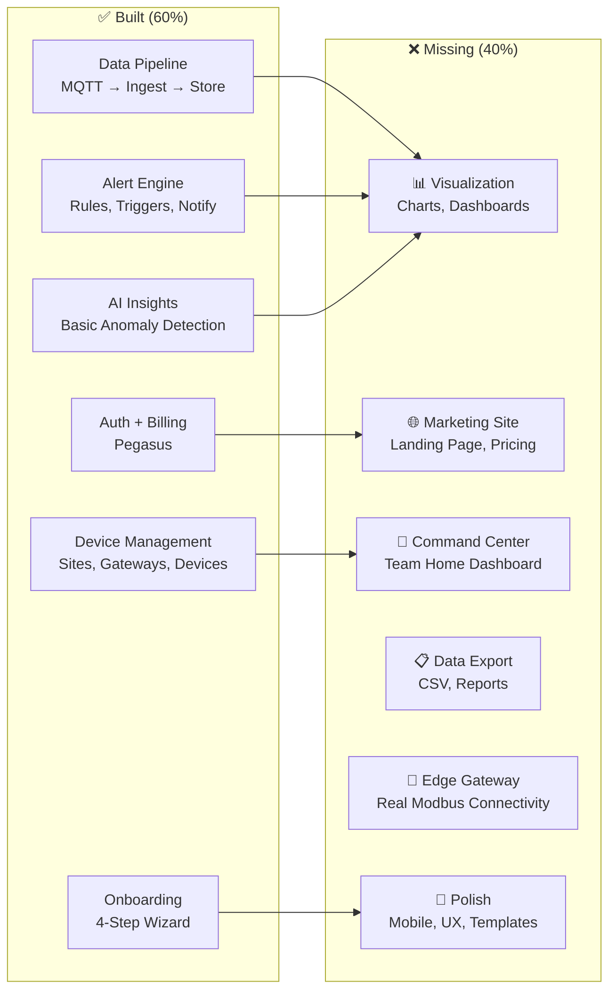

> **Historical reference — do not use as current implementation guidance.** See the [current CTO review](../../cto_product_progress_review_2026-07-18.md).

# Novena Progress Review — Codebase Audit & Next Steps

> **Historical review:** This document records the 10 April 2026 state. The current cross-repository assessment is [CTO Product Progress Review — 18 July 2026](cto_product_progress_review_2026-07-18.md).

> **Date:** April 10, 2026  
> **Goal:** "Shopify for IIoT" — the brand ASEAN SMEs think of for industrial monitoring  
> **Current State:** Significant technical foundation built. Not yet a product someone would pay for.

---

## 1. Progress Scorecard — What's Built vs What's Needed

### ✅ What You've Built (Impressive Progress)

| Feature | Status | Quality | Notes |
|---------|--------|---------|-------|
| **Multi-tenant architecture** (Teams) | ✅ Done | 🟢 Solid | Pegasus teams + BaseTeamModel everywhere |
| **User auth** (signup, login, 2FA, Google OAuth) | ✅ Done | 🟢 Solid | Pegasus standard |
| **Stripe subscriptions + billing** | ✅ Done | 🟢 Solid | Pegasus standard |
| **Device limit enforcement** (per plan) | ✅ Done | 🟢 Solid | `enforcement.py` with Starter/Pro/Business tiers |
| **Site management** (CRUD) | ✅ Done | 🟢 Solid | Create/edit/delete sites with address, timezone, lat/lng |
| **Gateway management** (CRUD) | ✅ Done | 🟢 Solid | Serial number, access token generation, status tracking |
| **Device management** (CRUD) | ✅ Done | 🟢 Solid | Linked to gateway/site/template, energy categories |
| **Device templates** (register maps) | ✅ Done | 🟡 MVP | Eastron SDM630, Schneider PM5110, generic temp sensor. Needs more |
| **MQTT broker** (Mosquitto) | ✅ Done | 🟢 Solid | Docker-compose integrated |
| **MQTT consumer** (Django management command) | ✅ Done | 🟢 Solid | Subscribes to `v1/gateway/telemetry`, parses, ingests |
| **MQTT payload parser** | ✅ Done | 🟢 Solid | Supports Novena format + ThingsBoard Gateway format |
| **Telemetry ingestion pipeline** | ✅ Done | 🟢 Solid | `ingest_telemetry_data()` → bulk create → alert check → device update |
| **Telemetry data model** (TimescaleDB-ready) | ✅ Done | 🟢 Solid | Separate numeric/string/bool fields, indexed on (device, key, timestamp) |
| **Alert rules** (threshold-based) | ✅ Done | 🟢 Solid | gt/lt/gte/lte/eq/neq, severity, cooldown, per-device or per-site |
| **Alert triggering engine** | ✅ Done | 🟢 Solid | Real-time on ingestion, cooldown deduplication |
| **Alert notifications** (email + webhook) | ✅ Done | 🟢 Solid | HTML email templates, JSON webhook POST |
| **AI anomaly detection** (z-score) | ✅ Done | 🟡 Basic | Statistical outlier detection on active_power and voltage |
| **AI weekly trend insight** | ✅ Done | 🟡 Basic | Compares current hour vs same hour last week |
| **Site summary stats** (SQL aggregates) | ✅ Done | 🟡 MVP | Daily kWh + current power from continuous aggregates |
| **Onboarding wizard** (4-step) | ✅ Done | 🟢 Solid | Site → Gateway → Device → Alert. Session-based, back-navigable |
| **Setup wizard** (for existing customers) | ✅ Done | 🟢 Solid | Select existing site + connectivity type → gateway → device |
| **Gateway discovery API** | ✅ Done | 🟡 MVP | Edge gateway can POST discovered devices |
| **Port-map visualization** (site detail) | ✅ Done | 🟢 Solid | Shows registered/discovered/conflicting devices per gateway port |
| **Quick-add device** (HTMX modal) | ✅ Done | 🟢 Solid | Template search, pre-fill from discovery, conflict resolution |
| **Template automation** (alert presets) | ✅ Done | 🟢 Solid | Auto-creates alert rules from template presets |
| **Device simulator** (energy data) | ✅ Done | 🟢 Solid | Sine-wave power, voltage, solar gen, publishes via MQTT |
| **UI design** (site detail page) | ✅ Done | 🟢 Polished | Beautiful KPI cards, AI insights panel, infrastructure hub, dark mode |
| **Docker compose** (full stack) | ✅ Done | 🟢 Solid | Postgres, TimescaleDB, Redis, Mosquitto, Django, Celery, MQTT consumer, Vite |
| **Celery** (background tasks) | ✅ Done | 🟢 Solid | Worker + beat configured |

### That's a LOT done. You've built roughly **60% of the MVP scope** from our original architecture plan.

---

### ❌ What's Missing — The Gaps That Matter

Here's what stands between the current codebase and a product someone would pay for:

| Gap | Priority | Why It Matters | Effort |
|-----|----------|---------------|--------|
| **1. Real-time dashboard/charts** | 🔴 CRITICAL | Users need to SEE their data — live power charts, voltage, etc. Currently no chart rendering on device detail | 2-3 days |
| **2. Historical data views** | 🔴 CRITICAL | "Show me last week's power usage" — time range selectors, data export. Customers expect this Day 1 | 3-5 days |
| **3. Landing page / marketing site** | 🔴 CRITICAL | Nobody can discover or understand your product. Wagtail is configured but no content | 3-5 days |
| **4. Customer-facing dashboard (home)** | 🔴 CRITICAL | `team_home` view needs an actual IoT command center — not the default Pegasus dashboard | 2-3 days |
| **5. Device detail charts** | 🔴 HIGH | Device detail page exists but has no telemetry visualization — the core value of the product | 2-3 days |
| **6. Alert management UI** | 🟡 HIGH | Alert list page exists but users need to create/edit/delete rules through the UI, not just onboarding | 2-3 days |
| **7. More device templates** | 🟡 HIGH | Only 3 templates. Need 10-20 covering common power meters, VFDs, temp sensors across brands | 2-3 days |
| **8. Data export** (CSV/Excel) | 🟡 HIGH | Compliance requirement in SG. Customers need to download their data | 1-2 days |
| **9. Mobile responsive testing** | 🟡 MEDIUM | Factory managers check alerts on their phone. Current templates may not be optimized | 2-3 days |
| **10. Edge gateway software** | 🟡 MEDIUM | We have a simulator but no actual gateway software that runs on RPi and talks Modbus | 1-2 weeks |
| **11. TimescaleDB hypertable migration** | 🟡 MEDIUM | Model says "converted to hypertable in migrations" but needs verification | 1 day |
| **12. Subscription plan setup** (Stripe) | 🟡 MEDIUM | Enforcement code exists but actual Stripe products/prices need to be created | 1 day |
| **13. API for external integrations** | 🟢 LOW | REST API for customers to pull their data programmatically | 3-5 days |
| **14. Reporting** (automated PDF/email) | 🟢 LOW | Weekly/monthly energy reports — differentiator but not MVP | 1 week |
| **15. LLM-powered chat** (ask your data) | 🟢 LOW | "How much energy did Building A use last month?" — Pegasus chat is ready | 1 week |

---

## 2. Honest Assessment — Where Are We Really?



### The Blunt Truth

> **You've built the engine but not the dashboard.** The most expensive and important parts of the backend are done — MQTT pipeline, telemetry storage, alert engine, device management, subscription enforcement. But a customer logging in today would see data models working correctly in the background, with very little to actually *look at* on their screen.

> **The product is 60% built but 20% "demoable."** You can't currently show this to a potential customer and have them understand the value. The critical gap is **visualization** — charts, graphs, a beautiful command center dashboard.

---

## 3. What "Done" Looks Like — The End Goal State

Let me paint the picture of what Novena needs to be to match our "Shopify for IIoT" vision:

### Product Completeness (For Paying Customers)

| Capability | Current | Target | Gap |
|-----------|---------|--------|-----|
| Sign up → onboard → see live data | ❌ Breaks at "see data" | < 10 minutes end-to-end | Charts + dashboard |
| Real-time monitoring dashboard | ❌ No charts | Beautiful command center with live KPIs | Critical build |
| Historical trends (day/week/month) | ❌ Not implemented | Time-range charts with zoom, export | Critical build |
| Alert management (full lifecycle) | ⚠️ Create via wizard only | Create/edit/delete/acknowledge via full UI | Need CRUD views |
| Energy reporting | ❌ Not implemented | Weekly summary email, PDF download | Phase 2 |
| Device template library | ⚠️ 3 templates | 20+ covering common SG/ASEAN equipment | Need research + data entry |
| Mobile experience | ⚠️ Unknown | Fully responsive, WhatsApp alerts | Need testing + optimization |
| Marketing website | ❌ None | Professional landing, pricing, case studies | Wagtail + content |
| Documentation / Help | ❌ None | User guide, gateway setup guide, FAQ | Content creation |

### Business Infrastructure (For Revenue)

| Capability | Current | Target | Gap |
|-----------|---------|--------|-----|
| Stripe subscription plans | ⚠️ Code ready, no products | 3 published plans (Starter/Pro/Business) | Stripe config |
| PSG grant alignment | ❌ Not started | Listed as PSG pre-approved vendor | Application process (6+ months) |
| Terms of Service / Privacy | ⚠️ Pegasus default | SG PDPA-compliant terms | Legal review |
| Customer onboarding docs | ❌ None | Gateway setup guide, video walkthrough | Content |
| Support channel | ⚠️ Basic Pegasus support | Intercom/Crisp widget, SLA-based | Integration |
| Demo environment | ❌ None | Live demo account with simulated data | Seed + deploy |

---

## 4. Recommended Next Steps — Phased Approach

### Phase 1: Make It Demoable (2-3 Weeks)
*Goal: Show this to a potential customer and have them say "I want this."*

- [ ] **Build the Command Center dashboard** — team home page showing all sites, total devices, active alerts, energy summary, recent activity
- [ ] **Add Chart.js charts to device detail** — live telemetry line charts (power, voltage, temperature), auto-refresh via HTMX polling
- [ ] **Add historical data view** — date range picker → time-series chart with zoom, table view of raw data
- [ ] **Build alert CRUD UI** — list all rules, create new, edit, delete, toggle active/inactive
- [ ] **Add 10-15 more device templates** — research common SG power meters (Eastron, Schneider, ABB, Accuenergy), VFDs (ABB ACS, Danfoss, Yaskawa), temp sensors
- [ ] **TimescaleDB hypertable verification** — ensure the migration actually creates the hypertable and continuous aggregates
- [ ] **Deploy to staging** (DigitalOcean/Railway) — need a public URL for demos

### Phase 2: Make It Sellable (2-3 Weeks)
*Goal: A customer can sign up, pay, and start using the product.*

- [ ] **Build the marketing landing page** — hero section, feature cards, pricing, testimonials (use Wagtail)
- [ ] **Set up Stripe products** — create Starter ($99), Professional ($299), Business ($699) plans
- [ ] **Data export** — CSV download for telemetry data, filtered by device + date range
- [ ] **Email notifications polish** — branded alert emails with clear CTAs and dashboard links
- [ ] **Mobile responsive pass** — test and fix all pages on mobile
- [ ] **Demo mode** — seed script that creates a demo team with realistic simulated data
- [ ] **Basic user documentation** — "Getting Started" guide, gateway setup, FAQ

### Phase 3: Make It a Business (4-6 Weeks)
*Goal: Revenue, retention, and growth infrastructure.*

- [ ] **Edge gateway MVP** — fork TB Gateway, adapt for our backend, test with a real Modbus device
- [ ] **Automated reporting** — weekly energy summary email per site (Celery periodic task)
- [ ] **LLM integration** — "Ask about your data" chat using Pegasus AI chat + telemetry context
- [ ] **Customer support widget** — Intercom/Crisp integration
- [ ] **PSG grant application** — begin the process with EnterpriseSG
- [ ] **WhatsApp/SMS alerts** — Twilio integration for critical alerts
- [ ] **API documentation** — Swagger/Redoc for customers who want programmatic access (already have DRF Spectacular)
- [ ] **Referral program** — system integrator partner portal

---

## 5. Priority Matrix — What Moves the Needle Most?

```mermaid
quadrant-chart
    title Impact vs Effort
    x-axis "Low Effort" --> "High Effort"
    y-axis "Low Impact" --> "High Impact"
    quadrant-1 "Do Next (High Impact, High Effort)"
    quadrant-2 "Do First (High Impact, Low Effort)"
    quadrant-3 "Skip for Now"
    quadrant-4 "Nice to Have"
    "Charts on device detail": [0.25, 0.90]
    "Command center dashboard": [0.35, 0.85]
    "Landing page": [0.30, 0.80]
    "Historical data view": [0.40, 0.75]
    "Alert CRUD UI": [0.30, 0.65]
    "More templates": [0.20, 0.60]
    "Stripe plan setup": [0.10, 0.55]
    "Data export CSV": [0.15, 0.50]
    "Deploy to staging": [0.20, 0.70]
    "Edge gateway": [0.75, 0.60]
    "LLM chat": [0.60, 0.45]
    "Automated reports": [0.55, 0.50]
    "API docs": [0.40, 0.30]
    "PSG application": [0.70, 0.65]
    "WhatsApp alerts": [0.45, 0.40]
```

---

## 6. The Gap Between "Product" and "Shopify for IIoT"

To be honest: the gap between our current state and "the brand ASEAN thinks of for IoT" is still large. But here's how I think about it in stages:

```
Stage 1: Working Product (YOU ARE HERE → 3-4 weeks away)
├── Customers can sign up, connect devices (via simulator), see data, get alerts
├── We can demo it to prospects
└── Revenue: $0 → first pilot

Stage 2: Paying Customers (6-8 weeks away)
├── 5-10 paying customers in Singapore
├── Real devices connected via gateway
├── Case studies from early adopters
└── Revenue: S$3K-5K MRR

Stage 3: Product-Market Fit (4-6 months away)
├── 30-50 customers
├── <5% monthly churn
├── Customers referring other customers
├── Revenue: S$15K-30K MRR
└── PSG-listed

Stage 4: Regional Brand (12-18 months away)
├── 200+ customers across SG + MY + TH
├── System integrator partner network
├── Recognized at industry events
├── Revenue: S$100K+ MRR
└── "Shopify for IIoT" positioning established

Stage 5: Market Leader (2-3 years)
├── 1000+ customers across ASEAN
├── Acquisition interest from Schneider/Honeywell/Siemens
├── S$3M+ ARR
└── The brand SMEs think of for IIoT
```

> [!IMPORTANT]
> **We are at Stage 0.5 → Stage 1.** The single most important thing right now is to get to "demoable" — meaning someone can log in, see a beautiful dashboard with live data, get an alert, and think "I need this for my factory." That's Phase 1 above. Everything else follows from there.

---

## 7. My CTO Recommendation: Immediate Focus

> If I could only pick **3 things** to work on next, in order:

### 1. 📊 Charts + Device Detail Dashboard (3 days)
Add Chart.js time-series charts to the device detail page. Show live power, voltage, temperature. Auto-refresh with HTMX polling. This is the **core value visualization** — without it, customers can't see why they're paying.

### 2. 🏠 Command Center Home Page (2 days)
Replace the default Pegasus team home with an IIoT command center — aggregate KPIs across all sites, list of devices with status, active alerts, recent activity feed. This is what customers see when they log in. First impressions matter.

### 3. 🌐 Landing Page (3 days)
Build a professional marketing page with Wagtail — hero, features, pricing, "book a demo" CTA. Without this, nobody can find or evaluate us. This is what turns "I built something" into "I'm selling something."

### Total: ~8 working days to go from "impressive codebase" to "I can show this to investors and customers."

---

What do you want to tackle first?
