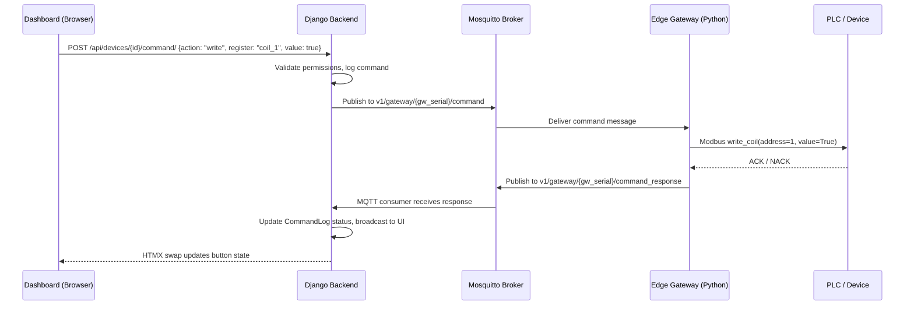
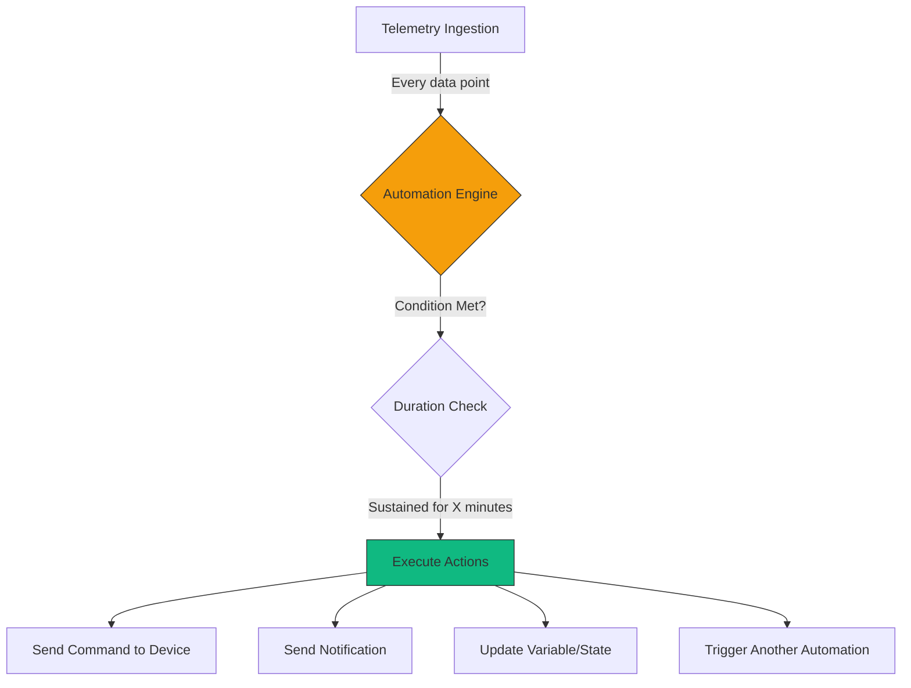
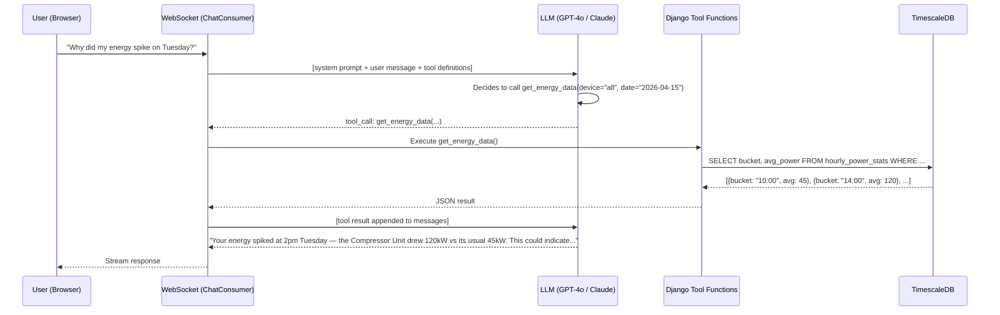
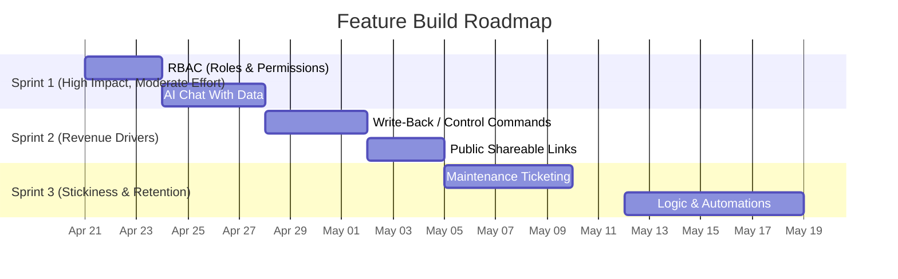

# Novena Feature Deep Dive — How to Build the "IIoT Shopify" Moat

> **Date:** April 17, 2026  
> **Author:** CTO  
> **Reference:** [gateway_and_features_brainstorm.md](file:///d:/Novena-Hub/docs/gateway_and_features_brainstorm.md) — Section 4  
> **Purpose:** Take each of the 6 high-value features we brainstormed and break down *exactly* how we'd build them on top of our existing Django + HTMX + MQTT stack.

---

## Current State Summary

Before we brainstorm, here's what we're building on:

| Layer | What Exists | Key Files |
|-------|------------|-----------|
| **Data Pipeline** | MQTT → `ingest_telemetry_data()` → TimescaleDB → Alert check | [services.py](file:///d:/Novena-Hub/apps/telemetry/services.py) |
| **Device Model** | Site → Gateway → Device hierarchy, templates, register maps | [models.py](file:///d:/Novena-Hub/apps/devices/models.py) |
| **Alert Engine** | Threshold rules, cooldown, email + webhook + WhatsApp (mock) | [services.py](file:///d:/Novena-Hub/apps/alerts/services.py), [notifications.py](file:///d:/Novena-Hub/apps/alerts/notifications.py) |
| **Teams/Multi-tenant** | Pegasus teams, `BaseTeamModel`, admin/member roles | [models.py](file:///d:/Novena-Hub/apps/teams/models.py), [roles.py](file:///d:/Novena-Hub/apps/teams/roles.py) |
| **AI Chat** | Pegasus chat with LiteLLM streaming via WebSocket | [consumers.py](file:///d:/Novena-Hub/apps/chat/consumers.py) |
| **Gateway Config** | `Gateway.config` JSONField, `Gateway.discovery_data` JSONField | [models.py](file:///d:/Novena-Hub/apps/devices/models.py#L30-L32) |

---

## Feature 1: Write-Back / Remote Control Commands

### What It Is
Not just *reading* data from PLCs — but **writing** commands back. A factory manager clicks a toggle on the Novena dashboard and a motor stops 200km away. This transforms us from a "dashboard" into a **Remote SCADA** system.

### Why It's a Game-Changer
- Most SME IoT platforms are read-only. Write-back is an enterprise feature that costs $10K+ in SCADA software.
- It justifies our **Professional** and **Business** tier pricing (S$299-699/mo).
- Customers who can *control* their equipment remotely have 10x higher retention vs read-only monitoring.

### Architecture Design



### Data Model

```python
# apps/devices/models.py (new model)
class DeviceCommand(BaseTeamModel):
    """A command sent to a device via the edge gateway."""
    STATUS_CHOICES = (
        ('pending', 'Pending'),
        ('sent', 'Sent'),
        ('acknowledged', 'Acknowledged'),
        ('failed', 'Failed'),
        ('timeout', 'Timeout'),
    )

    device = models.ForeignKey(Device, on_delete=models.CASCADE, related_name='commands')
    command_type = models.CharField(max_length=50)  # 'write_coil', 'write_register', 'custom'
    payload = models.JSONField()  # {"register": "coil_1", "value": true, "address": 100}
    status = models.CharField(max_length=20, choices=STATUS_CHOICES, default='pending')
    
    issued_by = models.ForeignKey(settings.AUTH_USER_MODEL, on_delete=models.SET_NULL, null=True)
    issued_at = models.DateTimeField(auto_now_add=True)
    acknowledged_at = models.DateTimeField(null=True, blank=True)
    response_payload = models.JSONField(default=dict, blank=True)
    
    # Safety: require confirmation for critical commands
    requires_confirmation = models.BooleanField(default=False)
    confirmed_by = models.ForeignKey(settings.AUTH_USER_MODEL, null=True, blank=True, 
                                       on_delete=models.SET_NULL, related_name='confirmed_commands')
```

### MQTT Topic Design

| Topic | Direction | Purpose |
|-------|-----------|---------|
| `v1/gateway/{serial}/command` | Cloud → Edge | Send command to gateway |
| `v1/gateway/{serial}/command_response` | Edge → Cloud | Gateway reports command result |
| `v1/gateway/{serial}/telemetry` | Edge → Cloud | (Existing) Sensor data |

### Implementation Steps

1. **Model + Migration** — Add `DeviceCommand` model (~30 min)
2. **API Endpoint** — `POST /api/devices/{id}/command/` with permission checks (~2 hrs)
3. **MQTT Publisher** — Utility to publish commands to the broker (~1 hr)
4. **MQTT Consumer Update** — Listen on `command_response` topic, update `DeviceCommand` status (~2 hrs)
5. **UI: Control Panel** — Add a "Controls" tab to device detail with toggle switches, sliders, input fields based on the device template's `register_map` (~4 hrs)
6. **Edge Gateway Handler** — In Repo 2 (Novena Gateway), subscribe to `command` topic, parse, execute Modbus write, publish response (~4 hrs)
7. **Audit Trail** — All commands logged, shown in a "Command History" table on device detail (~2 hrs)
8. **Safety Mode** — `requires_confirmation` flag for critical operations (e.g., "Stop Pump") — pops a confirmation modal (~2 hrs)

### Key Design Decisions

> [!WARNING]
> **Safety is paramount.** A bug in write-back could damage physical equipment or endanger lives. We MUST:
> - Require explicit role-based permission for write operations (ties into Feature 3: RBAC)
> - Log every single command with who issued it, when, and what happened
> - Add a `requires_confirmation` flag on templates for dangerous operations
> - Implement command timeout (30s default) so the UI doesn't hang forever

### Effort: ~3-4 days | Revenue Impact: HIGH (upgrades customers from Starter → Pro)

---

## Feature 2: Logic & Cloud Automations

### What It Is
"If Temperature > 50°C for 5 minutes, automatically turn on Chiller 2 via Modbus." — The platform handles logic in the cloud, saving customers from needing a PLC programmer.

### How It Differs From Current Alerts
Our current alert engine ([services.py](file:///d:/Novena-Hub/apps/alerts/services.py)) only *notifies*. It says "hey, temperature is high!" but doesn't *do* anything about it. Automations close the loop: **detect → decide → act**.

### Architecture Design



### Data Model

```python
# apps/automations/ (NEW APP)
class Automation(BaseTeamModel):
    """A user-defined automation rule: IF condition THEN action."""
    name = models.CharField(max_length=200)
    description = models.TextField(blank=True)
    is_active = models.BooleanField(default=True)
    
    # Trigger: What starts this automation?
    trigger_type = models.CharField(max_length=30, choices=[
        ('telemetry', 'Telemetry Value'),
        ('schedule', 'Time Schedule'),
        ('device_status', 'Device Status Change'),
        ('alert', 'Alert Triggered'),
    ])
    
    # Execution metadata
    last_triggered_at = models.DateTimeField(null=True, blank=True)
    trigger_count = models.PositiveIntegerField(default=0)
    cooldown_minutes = models.IntegerField(default=5)

class AutomationCondition(models.Model):
    """A single condition within an automation (supports AND/OR chaining)."""
    automation = models.ForeignKey(Automation, on_delete=models.CASCADE, related_name='conditions')
    
    device = models.ForeignKey('devices.Device', on_delete=models.CASCADE)
    telemetry_key = models.CharField(max_length=100)
    operator = models.CharField(max_length=10)  # gt, lt, gte, lte, eq, neq
    threshold = models.FloatField()
    duration_seconds = models.IntegerField(default=0)  # Must sustain for X seconds
    
    logic_operator = models.CharField(max_length=5, choices=[('AND', 'AND'), ('OR', 'OR')], default='AND')
    order = models.PositiveIntegerField(default=0)

class AutomationAction(models.Model):
    """What to do when the automation fires."""
    automation = models.ForeignKey(Automation, on_delete=models.CASCADE, related_name='actions')
    
    action_type = models.CharField(max_length=30, choices=[
        ('send_command', 'Send Device Command'),
        ('send_email', 'Send Email'),
        ('send_whatsapp', 'Send WhatsApp'),
        ('send_webhook', 'Send Webhook'),
        ('set_variable', 'Set Internal Variable'),
    ])
    
    # For send_command
    target_device = models.ForeignKey('devices.Device', null=True, blank=True, on_delete=models.SET_NULL)
    command_payload = models.JSONField(default=dict, blank=True)
    
    # For notifications
    notification_config = models.JSONField(default=dict, blank=True)
    
    order = models.PositiveIntegerField(default=0)

class AutomationLog(models.Model):
    """Execution log for audit and debugging."""
    automation = models.ForeignKey(Automation, on_delete=models.CASCADE, related_name='logs')
    triggered_at = models.DateTimeField(auto_now_add=True)
    conditions_snapshot = models.JSONField()  # What values triggered it
    actions_executed = models.JSONField()  # What actions ran and their results
    success = models.BooleanField(default=True)
    error_message = models.TextField(blank=True)
```

### How It Integrates With Our Pipeline

The key integration point is [ingest_telemetry_data()](file:///d:/Novena-Hub/apps/telemetry/services.py#L8). After we create telemetry records and check alerts, we add a third step:

```python
# In telemetry/services.py, after line 82:
from apps.automations.engine import evaluate_automations
evaluate_automations(target_device, values)
```

The `evaluate_automations()` function:
1. Queries all active automations for devices in this team
2. For each automation, checks if ALL conditions are met
3. For duration-based conditions, checks a Redis-backed state tracker
4. If conditions are met and cooldown has passed, executes actions sequentially
5. Logs the execution in `AutomationLog`

### Duration Tracking (Redis)

For "temperature > 50 for 5 minutes" — we need a state machine:

```python
# apps/automations/engine.py
import redis
from django.conf import settings

r = redis.Redis.from_url(settings.REDIS_URL)

def check_duration_condition(condition, current_value):
    """Track how long a condition has been continuously true."""
    cache_key = f"automation:{condition.automation_id}:cond:{condition.id}:since"
    
    condition_met = evaluate_operator(condition.operator, current_value, condition.threshold)
    
    if condition_met:
        # Record when condition first became true
        started = r.get(cache_key)
        if not started:
            r.set(cache_key, timezone.now().isoformat())
            return False  # Just started, duration not met yet
        
        elapsed = (timezone.now() - parse_datetime(started.decode())).total_seconds()
        return elapsed >= condition.duration_seconds
    else:
        # Condition broken, reset
        r.delete(cache_key)
        return False
```

### UI Design Concept

The automation builder should feel like a **simplified IFTTT** — not a code editor:

```
┌─────────────────────────────────────────────────────┐
│  ⚡ New Automation                                   │
├─────────────────────────────────────────────────────┤
│                                                     │
│  IF   [Chiller Room Temp ▼] [is above ▼] [8 °C]   │
│  FOR  [5] minutes                                  │
│  AND  [Compressor 1 ▼] [status is ▼] [online]     │
│                                                     │
│  ─────────── THEN ───────────                      │
│                                                     │
│  ☑ Turn ON [Backup Chiller ▼]                      │
│  ☑ Send WhatsApp to [Engineering Team]             │
│  ☐ Send Webhook to [...]                           │
│                                                     │
│  Cooldown: [15] minutes                            │
│                                                     │
│  [Cancel]                    [Save Automation]     │
└─────────────────────────────────────────────────────┘
```

### Implementation Steps

1. **Create `automations` app** — `python manage.py startapp automations` (~15 min)
2. **Models + Migrations** — Automation, AutomationCondition, AutomationAction, AutomationLog (~1 hr)
3. **Automation Engine** — `evaluate_automations()` with Redis duration tracking (~4 hrs)
4. **Integration with ingestion pipeline** — Hook into `ingest_telemetry_data()` (~30 min)
5. **CRUD Views** — List, create, edit, delete automations with HTMX (~6 hrs)
6. **Automation Builder UI** — The IFTTT-style form with dynamic device/key dropdowns (~4 hrs)
7. **Execution Logs View** — Table of recent automation runs with success/failure status (~2 hrs)
8. **Pre-built templates** — "Cold room too warm → backup chiller", "Motor fault → stop line" (~2 hrs)

> [!IMPORTANT]
> **This feature depends on Feature 1 (Write-Back).** Automations that only send notifications are just fancy alerts. The real power is automations that *control* equipment. Build Feature 1 first, then layer this on top.

### Effort: ~5-7 days | Revenue Impact: VERY HIGH (this is the "replace a PLC programmer" pitch)

---

## Feature 3: Role-Based Access Control (RBAC)

### What It Is
Fine-grained permissions: Factory Owner sees billing. Plant Manager sees dashboards. Shift Operator can only acknowledge alarms but cannot change configurations.

### What We Have Today
Pegasus gives us a basic 2-role system in [roles.py](file:///d:/Novena-Hub/apps/teams/roles.py):
- `admin` — Full control
- `member` — General access

This is not enough for a factory environment. A real factory has 4-6 distinct personas.

### Proposed Role Hierarchy

| Role | Dashboard | Devices | Alerts | Commands | Automations | Settings | Billing |
|------|-----------|---------|--------|----------|-------------|----------|---------|
| **Owner** | ✅ View | ✅ Full | ✅ Full | ✅ Full | ✅ Full | ✅ Full | ✅ Full |
| **Admin** | ✅ View | ✅ Full | ✅ Full | ✅ Full | ✅ Full | ✅ Full | ❌ |
| **Manager** | ✅ View | ✅ View/Edit | ✅ Create/Edit | ✅ Non-critical | ✅ View | ❌ | ❌ |
| **Operator** | ✅ View | ✅ View | ✅ Acknowledge | ✅ Approved only | ❌ | ❌ | ❌ |
| **Viewer** | ✅ View | ✅ View | ✅ View | ❌ | ❌ | ❌ | ❌ |

### Implementation Approach

Since Pegasus already wires roles through the `Membership` model, we extend — not replace — the existing system:

```python
# apps/teams/roles.py (UPDATED)
ROLE_OWNER = "owner"
ROLE_ADMIN = "admin"
ROLE_MANAGER = "manager"
ROLE_OPERATOR = "operator"
ROLE_VIEWER = "viewer"

ROLE_CHOICES = (
    (ROLE_OWNER, "Owner"),
    (ROLE_ADMIN, "Administrator"),
    (ROLE_MANAGER, "Site Manager"),
    (ROLE_OPERATOR, "Operator"),
    (ROLE_VIEWER, "Viewer"),
)

# Permission map
PERMISSIONS = {
    'view_dashboard': [ROLE_OWNER, ROLE_ADMIN, ROLE_MANAGER, ROLE_OPERATOR, ROLE_VIEWER],
    'manage_devices': [ROLE_OWNER, ROLE_ADMIN, ROLE_MANAGER],
    'view_devices': [ROLE_OWNER, ROLE_ADMIN, ROLE_MANAGER, ROLE_OPERATOR, ROLE_VIEWER],
    'manage_alerts': [ROLE_OWNER, ROLE_ADMIN, ROLE_MANAGER],
    'acknowledge_alerts': [ROLE_OWNER, ROLE_ADMIN, ROLE_MANAGER, ROLE_OPERATOR],
    'send_commands': [ROLE_OWNER, ROLE_ADMIN, ROLE_MANAGER],
    'send_critical_commands': [ROLE_OWNER, ROLE_ADMIN],
    'manage_automations': [ROLE_OWNER, ROLE_ADMIN],
    'view_automations': [ROLE_OWNER, ROLE_ADMIN, ROLE_MANAGER],
    'manage_team': [ROLE_OWNER, ROLE_ADMIN],
    'manage_billing': [ROLE_OWNER],
    'manage_shared_links': [ROLE_OWNER, ROLE_ADMIN, ROLE_MANAGER],
}

def has_permission(user, team, permission):
    """Check if a user has a specific permission within a team."""
    from .models import Membership
    try:
        membership = Membership.objects.get(user=user, team=team)
        return membership.role in PERMISSIONS.get(permission, [])
    except Membership.DoesNotExist:
        return False
```

### Decorator / Mixin for Views

```python
# apps/teams/decorators.py
from functools import wraps
from django.http import HttpResponseForbidden
from .roles import has_permission

def require_permission(permission):
    """Decorator for views that checks team-level permissions."""
    def decorator(view_func):
        @wraps(view_func)
        def wrapper(request, *args, **kwargs):
            team = request.team  # Set by Pegasus middleware
            if not has_permission(request.user, team, permission):
                return HttpResponseForbidden("You don't have permission to perform this action.")
            return view_func(request, *args, **kwargs)
        return wrapper
    return decorator

# Usage:
@require_permission('send_commands')
def send_device_command(request, device_id):
    ...
```

### Template Helpers

```python
# apps/teams/templatetags/team_permissions.py
@register.simple_tag(takes_context=True)
def has_perm(context, permission):
    """Template tag to check permissions — used to hide/show UI elements."""
    request = context.get('request')
    if not request or not request.team:
        return False
    return has_permission(request.user, request.team, permission)
```

```html
<!-- In templates -->



    <button>Turn On Motor</button>

```

### Implementation Steps

1. **Expand roles.py** — Add 5 roles + permissions map (~1 hr)
2. **Migration** — Update existing memberships (`member` → `viewer`, `admin` stays) (~30 min)
3. **Decorator + mixin** — `require_permission()` for views (~1 hr)
4. **Template tags** — `` tag for conditional UI rendering (~1 hr)
5. **Apply to all existing views** — Audit every view, apply appropriate permission (~3 hrs)
6. **Team Settings UI** — Update the member management page to show the new roles with descriptions (~2 hrs)
7. **Invitation flow** — Allow inviting with specific roles (~1 hr)

### Effort: ~2-3 days | Revenue Impact: MEDIUM (table-stakes for medium SMEs; they won't buy without it)

---

## Feature 4: Maintenance Ticketing

### What It Is
When an alert fires (e.g., VFD Fault), it auto-generates a Maintenance Ticket. Technicians can mark it "Resolved" with notes, photos, and parts used. This keeps maintenance workflows **inside** the platform rather than leaking to paper, email, or WhatsApp.

### Why It Matters
- **Stickiness**: Every maintenance ticket created is data that's *hard to migrate* to a competitor. This is golden for reducing churn.
- **Upsell narrative**: "Your maintenance team resolved 47 tickets this month, with an average response time of 23 minutes. Here's the trend..." — this is data that justifies the subscription.
- **Natural expansion**: Starts as alert-driven, grows into a full CMMS (Computerized Maintenance Management System).

### Data Model

```python
# apps/maintenance/ (NEW APP)
class MaintenanceTicket(BaseTeamModel):
    """A maintenance work order, auto-generated from alerts or manually created."""
    PRIORITY_CHOICES = (
        ('low', 'Low'),
        ('medium', 'Medium'),
        ('high', 'High'),
        ('critical', 'Critical'),
    )
    STATUS_CHOICES = (
        ('open', 'Open'),
        ('in_progress', 'In Progress'),
        ('waiting_parts', 'Waiting for Parts'),
        ('resolved', 'Resolved'),
        ('closed', 'Closed'),
    )
    
    title = models.CharField(max_length=300)
    description = models.TextField(blank=True)
    
    # Link to the source
    alert = models.ForeignKey('alerts.Alert', null=True, blank=True, 
                               on_delete=models.SET_NULL, related_name='tickets')
    device = models.ForeignKey('devices.Device', on_delete=models.CASCADE, related_name='tickets')
    site = models.ForeignKey('devices.Site', on_delete=models.CASCADE, related_name='tickets')
    
    priority = models.CharField(max_length=20, choices=PRIORITY_CHOICES, default='medium')
    status = models.CharField(max_length=20, choices=STATUS_CHOICES, default='open')
    
    # Assignment
    assigned_to = models.ForeignKey(settings.AUTH_USER_MODEL, null=True, blank=True, 
                                     on_delete=models.SET_NULL, related_name='assigned_tickets')
    
    # Timestamps
    opened_at = models.DateTimeField(auto_now_add=True)
    acknowledged_at = models.DateTimeField(null=True, blank=True)
    resolved_at = models.DateTimeField(null=True, blank=True)
    closed_at = models.DateTimeField(null=True, blank=True)
    
    # Resolution
    resolution_notes = models.TextField(blank=True)
    root_cause = models.CharField(max_length=200, blank=True)
    parts_used = models.JSONField(default=list, blank=True)  # [{"name": "Bearing", "qty": 2}]
    downtime_minutes = models.PositiveIntegerField(null=True, blank=True)

class TicketComment(models.Model):
    """Comments/updates on a maintenance ticket."""
    ticket = models.ForeignKey(MaintenanceTicket, on_delete=models.CASCADE, related_name='comments')
    author = models.ForeignKey(settings.AUTH_USER_MODEL, on_delete=models.CASCADE)
    content = models.TextField()
    created_at = models.DateTimeField(auto_now_add=True)
    
    # Support photo attachments (technician snaps a photo of the broken part)
    attachment = models.FileField(upload_to='ticket_attachments/', blank=True)

class TicketTemplate(models.Model):
    """Pre-defined ticket templates for common issues."""
    name = models.CharField(max_length=200)
    description_template = models.TextField()
    default_priority = models.CharField(max_length=20, default='medium')
    checklist = models.JSONField(default=list)  # ["Check belt tension", "Inspect bearings"]
```

### Auto-Generation from Alerts

The hook goes into [trigger_alert()](file:///d:/Novena-Hub/apps/alerts/services.py#L45):

```python
# In alerts/services.py, after line 68:
if rule.severity in ('critical', 'warning'):
    from apps.maintenance.services import auto_create_ticket
    auto_create_ticket(alert)
```

```python
# apps/maintenance/services.py
def auto_create_ticket(alert):
    """Auto-generate a maintenance ticket from a triggered alert."""
    # Prevent duplicate tickets for the same alert
    if hasattr(alert, 'tickets') and alert.tickets.filter(status__in=['open', 'in_progress']).exists():
        return None
    
    ticket = MaintenanceTicket.objects.create(
        team=alert.team,
        title=f"[AUTO] {alert.rule.name} — {alert.device.name}",
        description=(
            f"Alert triggered: {alert.rule.name}\n"
            f"Device: {alert.device.name}\n"
            f"Value: {alert.trigger_value} (threshold: {alert.rule.threshold})\n"
            f"Severity: {alert.rule.severity}"
        ),
        alert=alert,
        device=alert.device,
        site=alert.device.site,
        priority='critical' if alert.rule.severity == 'critical' else 'medium',
    )
    return ticket
```

### UI Concept

```
┌─────────────────────────────────────────────────────┐
│  🔧 Maintenance Tickets                    [+ New] │
├─────────────────────────────────────────────────────┤
│                                                     │
│  OPEN (3)  │  IN PROGRESS (1)  │  RESOLVED (12)   │
│                                                     │
│  ┌──────────────────────────────────────────────┐  │
│  │ 🔴 #047 — VFD Fault on Pump 3               │  │
│  │    Auto-generated from critical alert         │  │
│  │    Site: Jurong Factory │ 15 min ago          │  │
│  │    Assigned to: Ahmad (Technician)            │  │
│  │    [View] [Assign] [Resolve]                  │  │
│  └──────────────────────────────────────────────┘  │
│  ┌──────────────────────────────────────────────┐  │
│  │ 🟡 #046 — High Temperature Cold Room 2      │  │
│  │    Auto-generated from warning alert          │  │
│  │    Site: Changi Warehouse │ 2 hrs ago         │  │
│  │    Unassigned                                 │  │
│  │    [View] [Assign] [Resolve]                  │  │
│  └──────────────────────────────────────────────┘  │
└─────────────────────────────────────────────────────┘
```

### KPI Dashboard Widget

On the Command Center, add a maintenance summary card:

- **Open tickets**: 3 (1 critical)
- **Avg response time**: 23 min
- **Resolved this week**: 12
- **Total downtime this month**: 4.2 hrs

### Implementation Steps

1. **Create `maintenance` app** (~15 min)
2. **Models + Migrations** (~1 hr)
3. **Auto-generation service** — Hook into alert trigger (~1 hr)
4. **CRUD Views** — List (with tabs), detail, create, edit (~6 hrs)
5. **Ticket Detail View** — Timeline of comments, status changes, photo attachments (~4 hrs)
6. **Assignment + Notification** — When ticket is assigned, notify the technician via email/WhatsApp (~2 hrs)
7. **Command Center Widget** — Maintenance KPI card (~2 hrs)
8. **Ticket Templates** — Pre-built templates for common equipment types (~1 hr)

### Effort: ~4-5 days | Revenue Impact: HIGH (retention driver + competitive differentiator)

---

## Feature 5: Public Shareable Links

### What It Is
Generate a **read-only live URL** for a specific dashboard to share with:
- Third-party vendors monitoring their equipment on your premises
- Factory TV screens showing live production KPIs
- Investors or auditors who need temporary access

### Why It's a Growth Engine
- **Viral loop**: Every shared link exposes a non-customer to Novena. "Powered by Novena" in the footer.
- **Enterprise readiness**: Large SMEs need to share dashboards with external stakeholders.
- **Zero-friction onboarding**: Prospect sees a live dashboard → "I want this for my factory" → sign up.

### Data Model

```python
# apps/dashboard/models.py (new model)
class SharedDashboard(BaseTeamModel):
    """A publicly accessible, read-only dashboard link."""
    
    # What to share
    SHARE_TYPE_CHOICES = (
        ('site', 'Entire Site Dashboard'),
        ('device', 'Single Device Dashboard'),
        ('custom', 'Custom Widget Selection'),
    )
    
    share_type = models.CharField(max_length=20, choices=SHARE_TYPE_CHOICES)
    site = models.ForeignKey('devices.Site', null=True, blank=True, on_delete=models.CASCADE)
    device = models.ForeignKey('devices.Device', null=True, blank=True, on_delete=models.CASCADE)
    
    # Access control
    token = models.CharField(max_length=64, unique=True, db_index=True)  # UUID-based URL slug
    name = models.CharField(max_length=200)
    is_active = models.BooleanField(default=True)
    
    # Optional security
    password = models.CharField(max_length=128, blank=True)  # Optional PIN/password
    expires_at = models.DateTimeField(null=True, blank=True)
    
    # Branding
    show_novena_branding = models.BooleanField(default=True)  # "Powered by Novena"
    custom_logo = models.ImageField(upload_to='shared_dashboard_logos/', blank=True)
    
    # Analytics
    view_count = models.PositiveIntegerField(default=0)
    last_viewed_at = models.DateTimeField(null=True, blank=True)
    
    created_by = models.ForeignKey(settings.AUTH_USER_MODEL, on_delete=models.CASCADE)
```

### URL Design

```
Public URL:  https://app.${NOVENA_DOMAIN}/shared/{token}/
Example:     https://app.${NOVENA_DOMAIN}/shared/a1b2c3d4e5f6/
```

This is a **completely separate view** — no authentication required, no navigation chrome, just a clean dashboard with auto-refreshing HTMX charts.

### Implementation Steps

1. **Model + Migration** (~30 min)
2. **Token generation** — `secrets.token_urlsafe(32)` on create (~15 min)
3. **Public dashboard view** — A new URL route outside the auth middleware, renders a stripped-down dashboard template (~4 hrs)
4. **HTMX auto-refresh** — Same chart components as device detail, but in read-only mode (~2 hrs)
5. **Share management UI** — List shared links, create new, copy link, toggle active, set expiry (~3 hrs)
6. **Analytics tracking** — Increment `view_count` on each hit, show in management UI (~1 hr)
7. **Optional password gate** — Simple password form before showing dashboard (~1 hr)
8. **TV/Kiosk mode** — Add a `?kiosk=1` parameter that hides the header and auto-cycles between pages (~2 hrs)

### Effort: ~3-4 days | Revenue Impact: HIGH (virality + enterprise readiness)

---

## Feature 6: AI "Chat With Your Data"

### What It Is
Leverage the existing Pegasus chat UI + LiteLLM integration to let users ask plain English questions about their factory data. The LLM queries TimescaleDB behind the scenes and translates raw numbers into actionable insights.

### What We Have Today
The [ChatConsumer](file:///d:/Novena-Hub/apps/chat/consumers.py) already handles WebSocket streaming with LiteLLM. But it's a **generic chatbot** — it has zero knowledge of the user's devices, data, or alerts.

### Architecture: OpenAI Function Calling (Tool Use)



### Tool Definitions

```python
# apps/chat/tools.py (NEW FILE)
NOVENA_TOOLS = [
    {
        "type": "function",
        "function": {
            "name": "get_energy_data",
            "description": "Get energy consumption data (kWh, power) for a site or device over a time range",
            "parameters": {
                "type": "object",
                "properties": {
                    "site_name": {"type": "string", "description": "Name of the site/location"},
                    "device_name": {"type": "string", "description": "Name of specific device (optional)"},
                    "start_date": {"type": "string", "description": "Start date in YYYY-MM-DD format"},
                    "end_date": {"type": "string", "description": "End date in YYYY-MM-DD format"},
                    "granularity": {"type": "string", "enum": ["hourly", "daily", "weekly"]},
                },
                "required": ["start_date", "end_date"]
            }
        }
    },
    {
        "type": "function",
        "function": {
            "name": "get_device_status",
            "description": "Get current status and latest readings for one or all devices",
            "parameters": {
                "type": "object",
                "properties": {
                    "device_name": {"type": "string", "description": "Device name, or 'all' for all devices"},
                    "site_name": {"type": "string", "description": "Filter by site name (optional)"},
                }
            }
        }
    },
    {
        "type": "function",
        "function": {
            "name": "get_alerts_summary",
            "description": "Get a summary of recent alerts: count by severity, most frequent, and active alerts",
            "parameters": {
                "type": "object",
                "properties": {
                    "days": {"type": "integer", "description": "Number of past days to look at", "default": 7},
                    "severity": {"type": "string", "enum": ["info", "warning", "critical"]},
                    "device_name": {"type": "string"},
                }
            }
        }
    },
    {
        "type": "function",
        "function": {
            "name": "compare_periods",
            "description": "Compare telemetry data between two time periods (e.g., this week vs last week)",
            "parameters": {
                "type": "object",
                "properties": {
                    "metric": {"type": "string", "description": "e.g., 'active_power', 'temperature', 'voltage'"},
                    "device_name": {"type": "string"},
                    "period_1_start": {"type": "string"},
                    "period_1_end": {"type": "string"},
                    "period_2_start": {"type": "string"},
                    "period_2_end": {"type": "string"},
                }
            }
        }
    },
    {
        "type": "function",
        "function": {
            "name": "get_maintenance_summary",
            "description": "Get a summary of maintenance tickets: open, resolved, avg response time",
            "parameters": {
                "type": "object",
                "properties": {
                    "days": {"type": "integer", "default": 30},
                    "status": {"type": "string", "enum": ["open", "in_progress", "resolved", "closed"]},
                }
            }
        }
    }
]
```

### Tool Executor

```python
# apps/chat/tool_executor.py (NEW FILE)
from django.db.models import Avg, Sum, Count, Q
from apps.telemetry.models import TelemetryData
from apps.devices.models import Device, Site
from apps.alerts.models import Alert
from datetime import datetime, timedelta

class NovenaToolExecutor:
    """Executes LLM tool calls against the user's team data."""
    
    def __init__(self, team):
        self.team = team
    
    def execute(self, function_name, arguments):
        """Route tool call to the appropriate handler."""
        handlers = {
            'get_energy_data': self._get_energy_data,
            'get_device_status': self._get_device_status,
            'get_alerts_summary': self._get_alerts_summary,
            'compare_periods': self._compare_periods,
            'get_maintenance_summary': self._get_maintenance_summary,
        }
        handler = handlers.get(function_name)
        if not handler:
            return {"error": f"Unknown function: {function_name}"}
        
        try:
            return handler(**arguments)
        except Exception as e:
            return {"error": str(e)}
    
    def _get_energy_data(self, start_date, end_date, site_name=None, 
                          device_name=None, granularity='hourly'):
        """Query TimescaleDB energy aggregates."""
        from django.db import connection
        
        # Build device filter scoped to team
        device_filter = "d.site_id IN (SELECT id FROM devices_site WHERE team_id = %s)"
        params = [self.team.id]
        
        if site_name:
            device_filter += " AND d.site_id IN (SELECT id FROM devices_site WHERE name ILIKE %s AND team_id = %s)"
            params.extend([f"%{site_name}%", self.team.id])
        
        if device_name:
            device_filter += " AND d.name ILIKE %s"
            params.append(f"%{device_name}%")
        
        table = 'hourly_power_stats' if granularity == 'hourly' else 'daily_energy_stats'
        
        with connection.cursor() as cursor:
            cursor.execute(f"""
                SELECT h.bucket, SUM(h.avg_power) as total_power, SUM(h.kwh_total) as total_kwh
                FROM {table} h
                JOIN devices_device d ON h.device_id = d.id
                WHERE {device_filter}
                AND h.bucket >= %s AND h.bucket <= %s
                GROUP BY h.bucket
                ORDER BY h.bucket
            """, params + [start_date, end_date])
            
            rows = cursor.fetchall()
        
        return {
            "data": [{"time": str(r[0]), "avg_power_kw": r[1], "total_kwh": r[2]} for r in rows],
            "total_records": len(rows)
        }
    
    # ... similar implementations for other tools
```

### System Prompt

```python
NOVENA_SYSTEM_PROMPT = """You are the Novena AI Assistant — an expert in industrial IoT, 
energy management, and factory operations. You help facility managers understand their 
equipment data, diagnose issues, and optimise operations.

You have access to real-time and historical data from the user's connected devices. 
Use the available functions to query actual data before answering questions.

Guidelines:
- Always ground your answers in real data. Call the appropriate function first.
- Present numbers in a clear, non-technical way.
- Proactively suggest optimizations and cost savings when you spot patterns.
- If you detect anomalies, explain what might be causing them.
- Use Singapore dollars (S$) for cost estimates. Use 0.25 S$/kWh as the electricity rate unless told otherwise.
- Be concise but thorough. Factory managers are busy people.
"""
```

### Changes to ChatConsumer

The main change is adding tool-calling support to the [_stream_response_text()](file:///d:/Novena-Hub/apps/chat/consumers.py#L112) method:

```python
# Modified ChatConsumer.receive() — high-level pseudocode
async def receive(self, text_data):
    # ... existing message handling ...
    
    # Inject system prompt with team context
    system_msg = {
        "role": "system", 
        "content": NOVENA_SYSTEM_PROMPT + f"\n\nTeam: {self.team.name}"
    }
    messages = [system_msg] + self.messages
    
    # Call LLM with tools
    response = await litellm.acompletion(
        messages=messages, 
        tools=NOVENA_TOOLS, 
        stream=False,  # Can't stream tool calls
        **get_llm_kwargs()
    )
    
    # Check if LLM wants to call a tool
    if response.choices[0].message.tool_calls:
        for tool_call in response.choices[0].message.tool_calls:
            # Execute the tool
            executor = NovenaToolExecutor(self.team)
            result = executor.execute(
                tool_call.function.name, 
                json.loads(tool_call.function.arguments)
            )
            # Append tool result to messages
            messages.append(response.choices[0].message)
            messages.append({
                "role": "tool",
                "tool_call_id": tool_call.id,
                "content": json.dumps(result)
            })
        
        # Second LLM call with tool results — this one we stream
        final_response = await self._stream_response_text(contents_div_id, messages)
    else:
        # No tool call, stream directly
        final_response = response.choices[0].message.content
```

### Example Conversations

| User Says | LLM Does | LLM Responds |
|-----------|----------|-------------|
| "How much energy did we use yesterday?" | Calls `get_energy_data(start="2026-04-16", end="2026-04-16")` | "Your Jurong Factory consumed 342 kWh yesterday, costing approximately S$85.50. This is 12% higher than your weekly average." |
| "Which device is using the most power?" | Calls `get_device_status(device="all")` | "Compressor Unit 1 is drawing 45.2 kW right now — that's 62% of your total site load. The next highest is the CNC Mill at 12.1 kW." |
| "Were there any alerts this week?" | Calls `get_alerts_summary(days=7)` | "You had 8 alerts this week: 2 critical (both VFD faults on Pump 3), 4 warnings, 2 info. The VFD faults recurred Tuesday and Thursday — I'd recommend scheduling a maintenance check." |
| "Compare this month's energy to last month" | Calls `compare_periods(metric="active_power", ...)` | "April is tracking 15% higher than March. The biggest jump is on Compressor 2, which went from avg 22kW to 31kW. This could be a refrigerant leak reducing efficiency." |

### Implementation Steps

1. **System prompt** — Write the Novena-specific system prompt (~1 hr)
2. **Tool definitions** — Define 5-6 function schemas (~1 hr)
3. **Tool executor** — Implement each function with proper team scoping and SQL queries (~4 hrs)
4. **Modify ChatConsumer** — Add tool-calling loop with non-streaming first call + streaming second call (~3 hrs)
5. **Team context injection** — Pass `request.team` to the WebSocket consumer (~30 min)
6. **Testing** — Ask real questions against simulated data, iterate on prompt + tools (~2 hrs)
7. **UI polish** — Add "suggested questions" chips below the chat input (~1 hr)

> [!TIP]
> **Demo killer feature.** This is the single best feature to show in a sales demo. A prospect will type "how much energy am I wasting?" and Novena will give them a dollar amount. That's the moment they pull out their credit card.

### Effort: ~3-4 days | Revenue Impact: VERY HIGH (demo wow-factor + competitive differentiator)

---

## Feature Prioritization Matrix

Now that we've deep-dived each feature, here's my recommended build order:



### Why This Order?

| Order | Feature | Rationale |
|-------|---------|-----------|
| **1** | **RBAC** | Foundational — every other feature needs permission checks. Can't ship Write-Back or Automations without knowing who's allowed to use them. |
| **2** | **AI Chat** | Highest demo impact for lowest effort. Uses existing Pegasus chat infra. Will immediately differentiate us in every sales call. |
| **3** | **Write-Back** | Transforms the value proposition from "monitoring" to "control." Directly justifies higher-tier pricing. |
| **4** | **Shared Links** | Quick win that drives organic growth. Every link shared is a free marketing impression. |
| **5** | **Maintenance Ticketing** | Major retention driver. Once a customer's maintenance data is in Novena, they'll never leave. |
| **6** | **Automations** | Most complex feature, but also the most transformative. Depends on Write-Back being solid. This is the "replace a PLC programmer" pitch. |

---

## Total Effort Estimate

| Feature | Days | Dependencies |
|---------|------|-------------|
| RBAC | 2-3 | None |
| AI Chat | 3-4 | None |
| Write-Back | 3-4 | RBAC |
| Shared Links | 3-4 | None |
| Maintenance Ticketing | 4-5 | None (enhanced with alert engine) |
| Automations | 5-7 | Write-Back + RBAC |
| **TOTAL** | **~20-27 days** | |

> [!IMPORTANT]
> **This is ~5-6 weeks of heads-down building.** After this sprint, Novena wouldn't just be a monitoring dashboard — it would be a complete industrial operations platform that competes with enterprise SCADA systems costing $50K+. That's the pitch: "Everything your factory needs for S$299/month."

---

## Open Questions

1. **Which feature excites you most?** Should we start with AI Chat for demo impact, or RBAC for foundational correctness?
2. **PLC testing readiness** — Have you set up the Siemens S7-1200 with TIA Portal yet? Write-Back and Automations need the edge gateway to be functional for real testing.
3. **LLM budget** — AI Chat will use GPT-4o (or Claude) with tool calling. Should we set a per-team usage limit for the Starter tier? (e.g., 50 AI questions/month for Starter, unlimited for Pro+)
4. **Maintenance ticketing scope** — Do we want it to also handle *preventive* maintenance schedules (PM schedules), or keep it purely reactive (alert-triggered) for the MVP?
