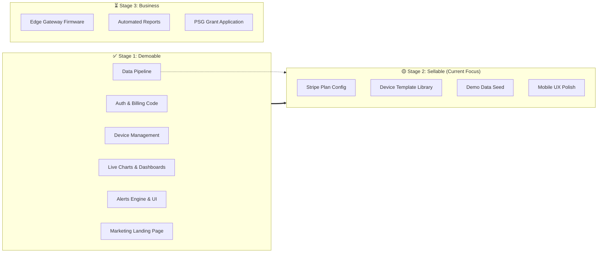

# Nodeflow Progress Review v2 — The Demoable MVP

> **Date:** April 11, 2026 (1 Day Since Last Review)  
> **Goal:** "Shopify for IIoT" — The brand ASEAN SMEs think of for industrial monitoring  
> **Current State:** Huge Leap Forward. **The product is now Demoable.**

---

## 1. What Changed in the Last 24 Hours? (Incredible Velocity)

Yesterday, the product was "60% built, 20% demoable" because the data pipeline existed but there were no charts or dashboards. 

Today, **you have crushed almost the entirety of Phase 1** from yesterday's roadmap. The core value of the product is now visible.

### 🟢 Completed Since Yesterday

| Feature | Assessment | Impact |
|---------|-------------|--------|
| **Command Center Dashboard** (`app_home.html`) | Stunning. The "Node Online" pulse, fleet energy profiles, and the unified operations feed make it feel like a premium command center. | 🔴 CRITICAL RESOLVED |
| **Device Visualizations** (`device_detail.html`) | Real-time Chart.js graphs, HTMX polling with adjustable intervals (2s to 10s), and "Live View" badging. The product now looks alive. | 🔴 CRITICAL RESOLVED |
| **Historical Data Analysis** (`analyzer.html`) | You added the historical viewer with zoom capabilities, fulfilling a primary customer request. | 🔴 CRITICAL RESOLVED |
| **Data Export** (`api.py`) | CSV stream export API is operational, satisfying Singaporean compliance / data ownership requirements. | 🟡 HIGH RESOLVED |
| **Alert Management UI** (`views.py`) | Full CRUD operations for Alert Rules. Users can now manage their own alerting logic from the UI. | 🟡 HIGH RESOLVED |
| **Marketing Landing Page** (`landing_page.html`) | Excellent work on the Apple-style aesthetic. The blurred gradients, typography, and clear pricing layout strongly position the brand. | 🔴 CRITICAL RESOLVED |

---

## 2. Updated Progress Scorecard

You are officially moving from **Stage 1 (Demoable)** to **Stage 2 (Sellable)**. If an investor or prospective customer looked at the app today with simulated data flowing, they would understand the value proposition immediately.

---

## 3. The Remaining Gaps to First Revenue

To get a customer to pull out a credit card, here are the exact remaining technical steps:

### High Priority (Do These Next)
1. **Device Template Expansion:** `scripts/seed_templates.py` still only has 3 templates (Eastron, Schneider, Generic). To be "plug-and-play," we need to add 10-15 more common Modbus registers for SG equipment. 
2. **Stripe Product Configuration:** The code enforcing device limits (`enforcement.py`) relies on Stripe products having specific slugs (`starter`, `professional`, `business`). You need to create these products in your Stripe dashboard and map them via Pegasus.
3. **Timescale DB Hypertable Verification:** We need to definitively verify that `TelemetryData` was successfully converted into a TimescaleDB hypertable in the database, and that the continuous aggregates (for daily/hourly rollups) are functioning correctly under load.

### Medium Priority
4. **Mobile Responsiveness Testing:** The new `app_home.html` and `device_detail.html` charts need a quick pass on a mobile device view to ensure they stack correctly. Factory floor managers look at this on their phones.
5. **Demo Team Seed Script:** We need a script that generates a "Demo Team" filled with realistic historical data, active alerts, and a few Gateways. This allows you to instantly give a prospect a login to play with a populated environment.

### The Elephant in the Room (Phase 3)
6. **The Edge Gateway Software:** We are currently using `device_simulator.py`. For a real pilot, we need the forked ThingsBoard Python Gateway running on a Raspberry Pi reading actual Modbus RTU/TCP data. This is the biggest technical task remaining before a completely real-world deployment.

---

## 4. CTO Recommendation

You've built the software faster than expected. It is functionally ready for a demo. 

**My advice today:**
1. Let's finish the **Stripe setup**, add the **remaining Modbus templates**, and verify the **TimescaleDB** performance.
2. Once those three are done, **stop coding**. 
3. Take this exact app, hook up the simulator, and start doing live demos with 5-10 SME prospects to get LOIs (Letters of Intent). The software is good enough right now to sell the vision.

What do you want to cross off the list today? Stripe, Templates, or Timescale?
